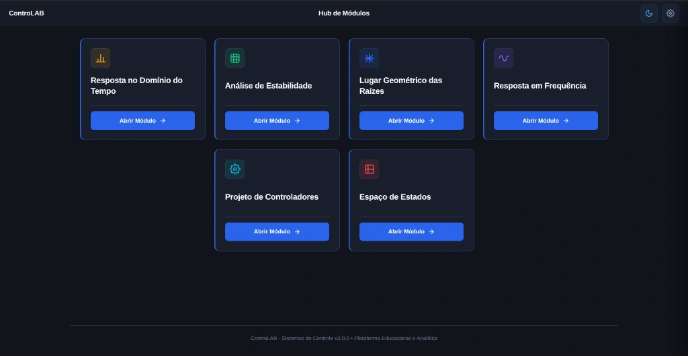
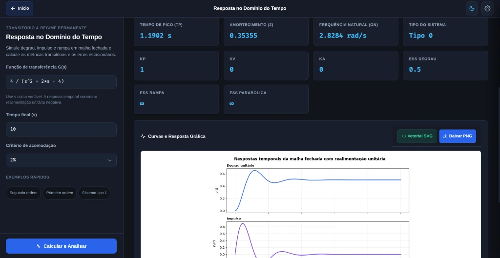
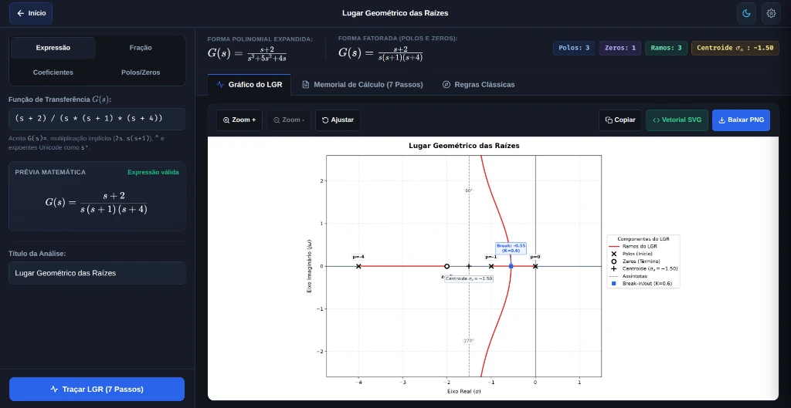
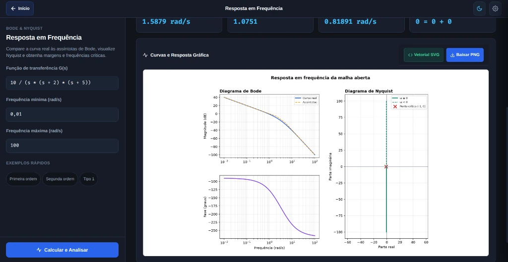
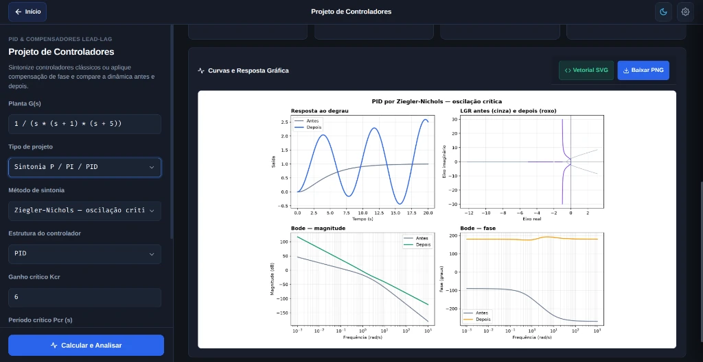
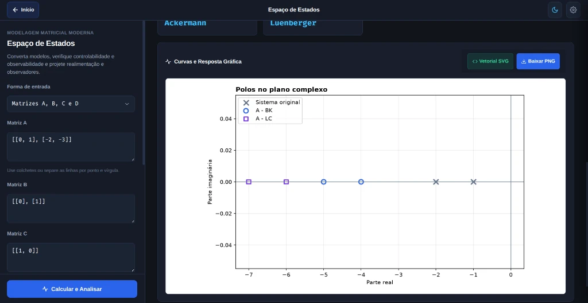

#  <strong>ControLAB — Suíte de Sistemas de Controle</strong>

> **Interface moderna, interativa e 100% offline para cálculo analítico, simulação e ensino de Sistemas de Controle com renderização matemática em tempo real.**

---

  
   
  <em>Hub Central unificando os domínios clássicos e modernos de sistemas de controle.</em>

---

## Instalação e Download

Para obter a versão mais recente, acesse a seção de [Releases no GitHub](https://github.com/enthonyaraujo/controlab/releases) e baixe o pacote correspondente ao seu sistema operacional: **Windows**, **Linux:**, **Android** e **Web / PWA.**

## Visão Geral

O **ControLAB** é uma plataforma educacional e analítica de Engenharia de Controle e Sistemas Dinâmicos. A ferramenta combina o rigor matemático do ecossistema científico em **Python** (`control`, `NumPy`, `SciPy`, `Matplotlib` e `SymPy`) com a agilidade de uma interface moderna em **Electron/HTML5/CSS3**.

A aplicação organiza os domínios clássicos e modernos de controle a partir de um Hub Central e oferece memorial passo a passo, equações renderizadas e gráficos vetoriais interativos.

---

## Interface da Aplicação

O ControLAB oferece uma interface escura, responsiva e 100% offline, projetada para estudo, simulação e projeto de sistemas dinâmicos. Veja abaixo as capturas de tela dos módulos em execução:
| Resposta no Domínio do Tempo | Lugar Geométrico das Raízes (LGR) |
| :---: | :---: |
|  |  |
| **Resposta em Frequência (Bode e Nyquist)** | **Projeto de Controladores (PID & Lead-Lag)** |
|  |  |
| **Modelagem em Espaço de Estados** | **Hub Central de Módulos** |
|  |  |

---
